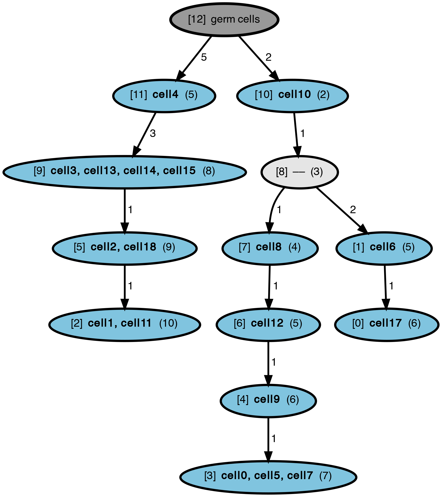

# PhISCS-BnB

PhISCS-BnB is a fast tool for reconstructing the perfect tumor phylogeny using single-cell data via branch and bound.

## Contents
  1. [Installation](#installation)
  2. [Running](#running)
     * [Input](#input)
     * [Output](#output)
     * [Parameters](#parameters)
  3. [Example](#example)
  4. [Contact](#contact)

<a name="installation"></a>
## Installation
PhISCS-BnB is written in Python. It supports Python 3. Currently it is intended to be run on POSIX-based systems (only Linux and macOS have been tested).  

```console
~$ git clone https://github.com/algo-cancer/PhISCS-BnB.git
~$ cd PhISCS-BnB
~$ pip install -r requirements.txt
~$ python main.py --help
```

<a name="running"></a>
## Running

<a name="input"></a>
### Input

Single-cell input is assumed to be represented in the form of ternary, __tab-delimited__, matrix with rows corresponding to single-cells and columns corresponding to mutations. We assume that this file contains headers and that matrix is ternary matrix with 0 denoting the absence and 1 denoting the presence of mutation in a given cell, whereas ? represents the lack of information about presence/absence of mutation in a given cell (i.e. missing entry). __In order to simplify parsing of the matrix, we also assume that upper left corner equals to string `cellID/mutID`__.

Below is an example of single-cell data matrix. Note that mutation and cell names are arbitrary strings not containing tabs or spaces, however they must be unique.
```
cellID/mutID  mut0  mut1  mut2  mut3  mut4  mut5  mut6  mut7
cell0         0     0     ?     0     0     0     0     0
cell1         0     ?     1     0     0     0     1     1
cell2         0     0     1     0     0     0     1     1
cell3         1     1     0     0     0     0     0     0
cell4         0     0     1     0     0     0     0     0
cell5         1     0     0     0     0     0     0     0
cell6         0     0     1     0     0     0     1     1
cell7         0     0     1     0     0     0     0     0
cell8         ?     0     0     0     ?     0     ?     1
cell9         0     1     0     0     0     0     0     0
```

<a name="output"></a>
### Output
The program will generate a file in **OUT_DIR** folder (which is set by argument -o or --outDir). This folder will be created automatically if it does not exist.

The output matrix is also a tab-delimited file having the same format as the input matrix, except that eliminated mutations (columns) are excluded (so, in case when mutation elimination is allowed, this matrix typically contains less columns than the input matrix). Output matrix represents genotypes-corrected matrix (where false positives and false negatives from the input are corrected and each of the missing entries set to 0 or 1). Suppose the input file is **INPUT_MATRIX.ext**, the output matrix will be stored in file **OUT_DIR/INPUT_MATRIX.CFMatrix**. For example:
```
 input file: data/ALL2.SC
output file: OUT_DIR/ALL2.CFMatrix
```

<a name="parameters"></a>
### Parameters
| Parameter  | Description                              | Default  | Mandatory      |
|------------|------------------------------------------|----------|----------------|
| -i         | Path to single-cell data matrix file     | -        | :radio_button: |
| -o         | Output directory                         | current  | :white_circle: |
| -b         | Bounding algorithm                       | 1        | :white_circle: |
| -t         | Draw output tree with Graphviz           | -        | :white_circle: |

<a name="example"></a>
## Example

```console
~$ python main.py -i example/data1.SC -o example -b 2 -t

[02/04 12:53:49] Size: (20, 20)
[02/04 12:53:49] NAValue: 3
[02/04 12:53:49] #Zeros: 226
[02/04 12:53:49] #Ones: 94
[02/04 12:53:49] #NAs: 80
[02/04 12:53:49] Time: 00:00:00
[02/04 12:53:49] #0->1: 10
[02/04 12:53:49] #1->0: 0
[02/04 12:53:49] #na->0: 60
[02/04 12:53:49] #na->1: 20
[02/04 12:53:49] isDone: True
[02/04 12:53:49] The output phylogenetic tree is in 'example' directory!
```

This is the clonal tree that has been created:
<p align="center">
  
</p>

For each node, the number inside the brackets denotes its node id and the number inside the parentheses shows the total number of mutations occurring on the path from the germline (root) to the node (i.e., the total number of mutations harbored by the node). The edge labels represent the number of mutations occurring between a parent and its child node. The complete list of mutations occurring at each edge can be found `data1.mutsAtEdges` file which contains:

```
[12]->[11]: mut7 mut8 mut9 mut10 mut11
[12]->[10]: mut0 mut2
[11]->[9]: mut15 mut16 mut17
[10]->[8]: mut1
[9]->[5]: mut18
[8]->[7]: mut3
[8]->[1]: mut12 mut14
[7]->[6]: mut5
[6]->[4]: mut4
[5]->[2]: mut19
[4]->[3]: mut6
[1]->[0]: mut13

```

<a name="contact"></a>
## Contact
If you have any questions please e-mail us at esadeqia@iu.edu or frashidi@iu.edu.
